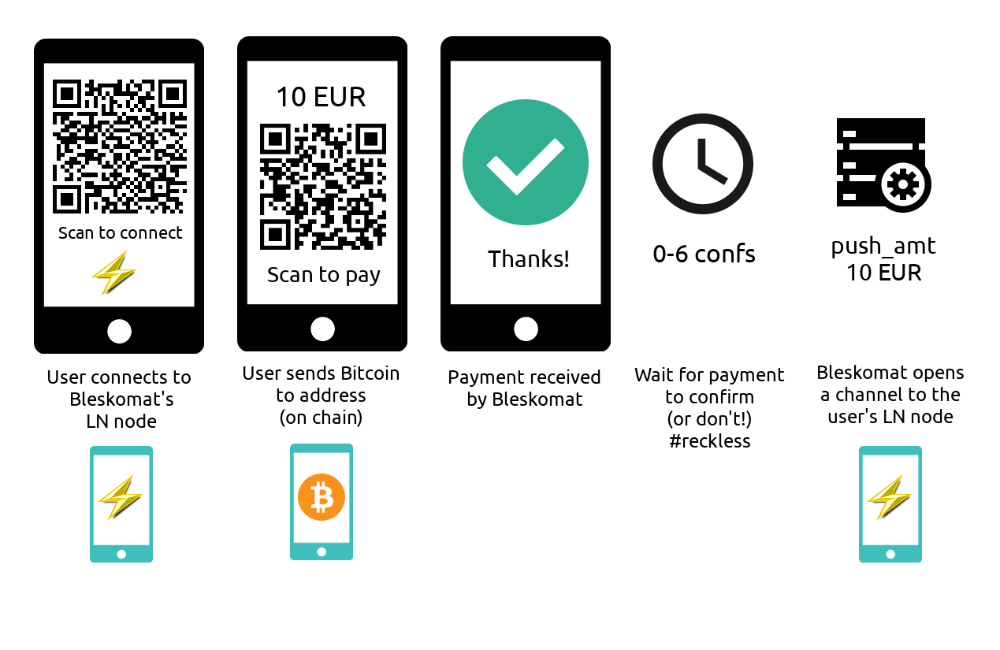

# Bleskomat

Cryptocurrency to Lightning Network ATM



## Requirements

- [git](https://git-scm.com/)
- [docker](https://docs.docker.com/install/)
- [docker compose](https://docs.docker.com/compose/install/)

Installation instructions will vary based on your operating system

## Getting Started

Before continuing, be sure to download and install the project [requirements](#requirements).

Get the LND fork from Learn-by-doing

```bash
git clone https://github.com/Learn-by-doing/lnd
```

Inside the repository go to the directory `docker`.

```bash
cd lnd/docker
```

### Build the containers using docker-compose:

We are going to run a bitcoin node and a lightning node in simnet, it means that we will create a simulation network that is totally under our control, so we can create blocks at will and therefore we do not have to wait.

Create the NETWORK variable to use simnet:

```bash
export NETWORK="simnet"
```

Run the container to use lnd with btcd, and give a name to it. Below we are setting the name "alice" to this container. But you can use other one.

```bash
docker-compose run -d --name alice lnd_btc
```

Log into the container:

```bash
docker exec -i -t alice bash
```

Once you are inside the container you can get information about the state of the network.

```bash
lncli --network=simnet getinfo
```

Create a new address:

```bash
lncli --network=simnet newaddress np2wkh
```

It will generate an output as below, of course with different address:

```bash
{
    "address": "rne7QS8kuJBNB7DJ5kARFYMbBjRvrbe4AN"
}
```

Then outside of the container we recreate "btcd" node and set the generated address as mining address:

```bash
MINING_ADDRESS=<your_address> docker-compose up -d btcd
```

Generate 400 blocks (we need at least "100 >=" blocks because of coinbase block maturity and "300 ~=" in order to activate segwit):

```bash
docker-compose run btcctl generate 400
```

Now you can check that segwit is active:

```bash
docker-compose run btcctl getblockchaininfo | grep -A 1 segwit
```

### Comunicate with lnd running in the container using http

LND uses [macaroons](https://github.com/lightningnetwork/lnd/blob/master/docs/macaroons.md) as authentication, they are like cookies with more functionality.

Copy the `admin.macaroon` file from lnd docker to your filesystem.

```bash
docker cp alice:/root/.lnd/data/chain/bitcoin/simnet/admin.macaroon ~/bleskomat
```

Then you need to find the IP where your container is running. You do it by running the command below:

```bash
docker inspect --format='{{range .NetworkSettings.Networks}}{{.IPAddress}}{{end}}' alice
```

It will return something like:

```bash
172.19.0.3
```

Once we have the IP and the `admin.macaroon` file, we can comunicate with lnd using curl using [lnd-rest](https://api.lightning.community/rest/index.html#lnd-rest-api-reference).

- getinfo

  ```bash
  curl -X GET --insecure -i "Grpc-Metadata-macaroon: $(xxd -ps -u -c 1000 ~/Desktop/admin.macaroon)" https://172.19.0.3:8001/v1/getinfo
  ```

- generate an invoice

  ```bash
  curl -X POST --insecure --header "Grpc-Metadata-macaroon: $(xxd -ps -u -c 1000 ~/Desktop/admin.macaroon)" --data '{"expiry":"144","value":"1000"}' https://172.19.0.3:8001/v1/invoices
  ```
