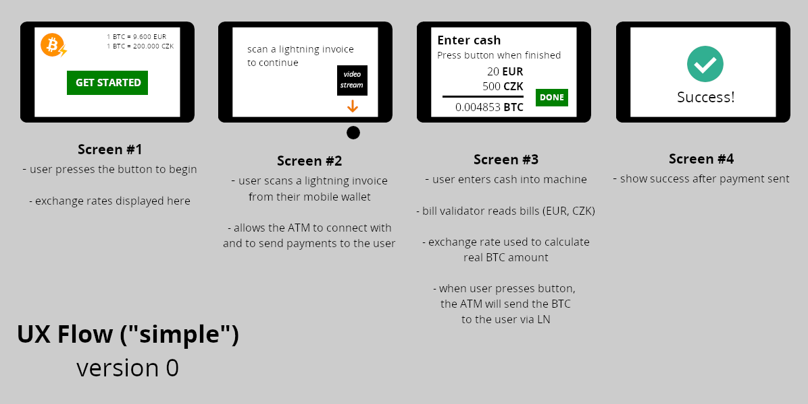

# Bleskomat

Open source software (+hardware) project to create a prototype Lightning Network ATM



If you would like to contribute to the project, the following should help get you started:
* [Requirements](#requirements)
* [Getting Started](#getting-started)
* [License](#license)


## Requirements

The following is a list of requirements needed to contribute to this project.

* [nodejs](https://nodejs.org/) - For Linux and Mac install node via [nvm](https://github.com/creationix/nvm).
* [lnd](https://github.com/lightningnetwork/lnd)


## Getting Started

Clone this git repository:
```bash
git clone git@github.com:samotari/bleskomat.git
```

Change into the app directory, install dependencies, build and run the app:
```bash
cd app
npm install
npm start
```

If you would like to have _partial_ hot reload while developing, run the following command in a separate terminal window:
```bash
npm run build:dev:watch
```
If you make any modifications in `app/renderer`, the build process will trigger automatically and you can see your changes in the Electron app by reloading the app (e.g. <kbd>CMD</kbd>+<kbd>R</kbd> on Mac, <kbd>CTRL</kbd>+<kbd>R</kbd> on Windows and Linux).


## Building App Packages

This project uses [electron-builder](https://www.electron.build/) to build packages for various platforms.

### Linux

To build a development app package for Linux (`.deb`):
```bash
npm run builder:dev
```
The architecture of the built `.deb` package will match your current system.

To build an app package for production:
```bash
npm run builder:prod
```

If you want to target a different architecture (e.g for raspberry pi):
```bash
npm run builder:prod -- --armv7l
```


## License

This project is licensed under the [GNU Affero General Public License v3 (AGPL-3.0)](https://tldrlegal.com/license/gnu-affero-general-public-license-v3-(agpl-3.0)).

> The AGPL license differs from the other GNU licenses in that it was built for network software. You can distribute modified versions if you keep track of the changes and the date you made them. As per usual with GNU licenses, you must license derivatives under AGPL. It provides the same restrictions and freedoms as the GPLv3 but with an additional clause which makes it so that source code must be distributed along with web publication. Since web sites and services are never distributed in the traditional sense, the AGPL is the GPL of the web.
